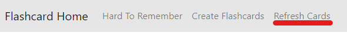

# Flashcard App Documentation
## Made with Django

IP: http://52.53.151.224:8000/

## How to run
1. Install python3 and pip3
2. Install Django: `pip3 install Django==3.1.4`
3. Clone repo
4. Run server: `python3 manage.py runserver`
5. Go to http://localhost:8000/
6. (Optional) Run tests: `python3 manage.py test`

## User Testing Tools
Refresh cards will set a user's flashcard levels, timers, and wrong counters back to 0. Any user has access to this.

### Requirements:
- [x] Flashcards must be displayed one at a time, with a word on one side and the definition on the other.
- [x] Users must be able to flip the flashcard to see the definition.
- [x] Users must be able to mark whether or not they knew the answer.
- [x] Each card will go up a level if the user knew the answer, and back to first level if they didn't.
- [x] If a card has a picked-wrong lifetime of 10, it will be removed from the deck.
- [x] If a card has been picked right 11 times, it will be removed from the deck.
- [x] Each card must have a timer that is constantly counting down depending on its level. The higher the level the higher the timer.
- [x] If the timer is positive for all cards, display a temporary message. If all cards are removed from deck then display permanent message.
- [x] User registration and login.
- [x] Flashcard CRUD.
- [x] Admin interface per user.

### Extra Features:
- [x] Flashcard interaction all on the home page.
- [x] Flashcard refresher tool that updates all flashcard attributes back to 0.
- [x] Django test file that tests Flashcard and User models.

## Design
### DB Schema
I used Django's built in User model for ease of use. This allowed me me to utilize Django's login and logout auth views. Each user has their own admin page, which is where they will control their own cards. This means that Flashcards are in a many-to-one relationship to Users. I created a Flashcard model that has a reference to the User. The Flashcard table tracks card's word, definition, level, last level change, timer(in seconds), and how many times it was picked wrong. For this design, I needed timer, level, and last level change rows because it was the only way I could figure out how to dynamically track time of each card without having to create another table.

### Views
The updateTimes function allows for time to be updated for each card upon page load by subtracting a card's last bin change from right now(datetime object). home and admin_view both call updateTimes so that the time appears to be counting down dynamically.
The home view handles most card logic because of the single-page app restriction. It receives post requests from ajax calls and updates the specified card. Reloading the home view will show cards that have not been answered wrong 10 times or cards in the 11th level.
The admin_tool view refreshes all cards data back to 0.
The flashcard CRUD views are only accessible through the admin page.
The user registration view utilizes Django's UserCreationForm class to create a new user. Login and logout views were not necessary to write as Django handles that for us.

### Frontend
Used: Bootstrap, jQuery, and Ajax
Most elements utilize bootstrap classes. I used jQuery to make the ajax calls and to update the DOM. Both frontend and backend use a hashmap to keep track of each level's time cooldown, converted in seconds. Upon loading the home page, any card with a positive timer will start counting down. Clicking either button (right or wrong) will call handleNext() which will make an ajax post, calculate the appropriate bin for that card, sort the flashcards(so that flashcard with the next lowest time will show), check any end message conditions, and cycle to the next card.

### Tests
Users test file tests for user registration, login and logout functionality. Flashcard test file tests for flashcard CRUD functionality. First test makes query tests, second test uses https://dictionaryapi.dev/, populates the database with 3 cards, and tests the home page functionality with get and post requests.